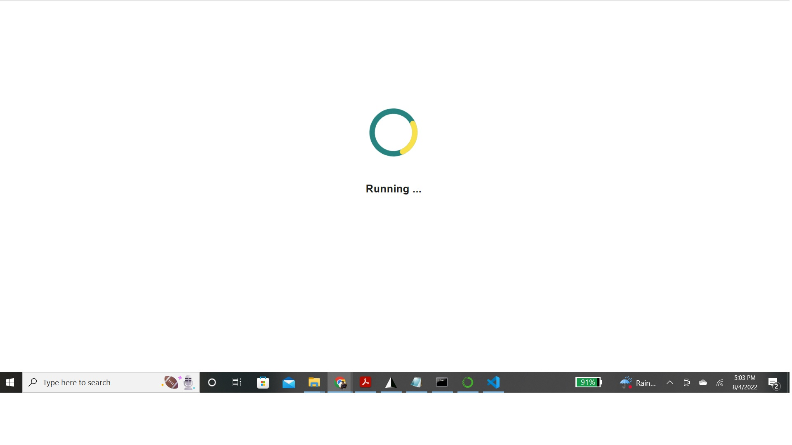
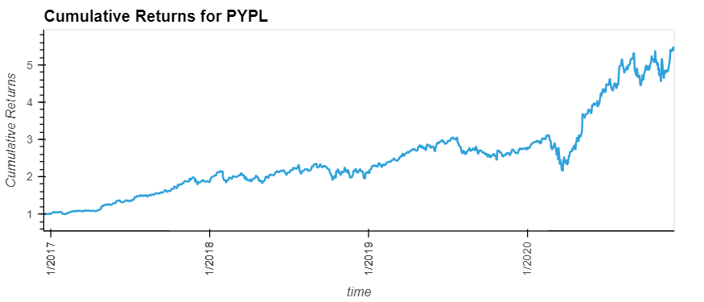

# Challenge7

This is a program that analyzes etf returns using sql and database information.

---

## Technologies

This project leverages python 3.7 with the following packages:


* [pandas](https://github.com/pandas-dev/pandas) - Flexible and powerful data analysis / manipulation library for Python, providing labeled data structures similar to R data.frame objects, statistical functions, and much more

* [pathlib](https://github.com/budlight/pathlib) - Specifies a path

* [bokeh.models.formatters](https://github.com/bokeh/bokeh/blob/branch-3.0/bokeh/models/formatters.py) - Manages tick markings when plotting.

* [hvplot.pandas](https://github.com/holoviz/hvplot) - A high-level plotting API for pandas, dask, xarray, and networkx built on HoloViews.

* [sqlalchemy](https://github.com/sqlalchemy/sqlalchemy) - Database toolkit for Python.

---

## Installation Guide

Before running the application first install the following dependencies.

```python
  pip install pandas
  pip install -c pyviz hvplot
  conda install -c conda-forge voila
  pip install SQLAlchemy
```

---

## Usage

This application runs a fixed program for analysis.  The application can be manipulated by interacting with the generated plots to look through the different results.

Examples images from the program:

 
Note: Voila crashed kernel
 

## Contributors

Brought to you by Russell Moore & Columbia Fintech Bootcamp.

---
## License

Open Source

## Version

First Version.  Two-Thirds code written

Second Version/Final.  Finalized version of code.